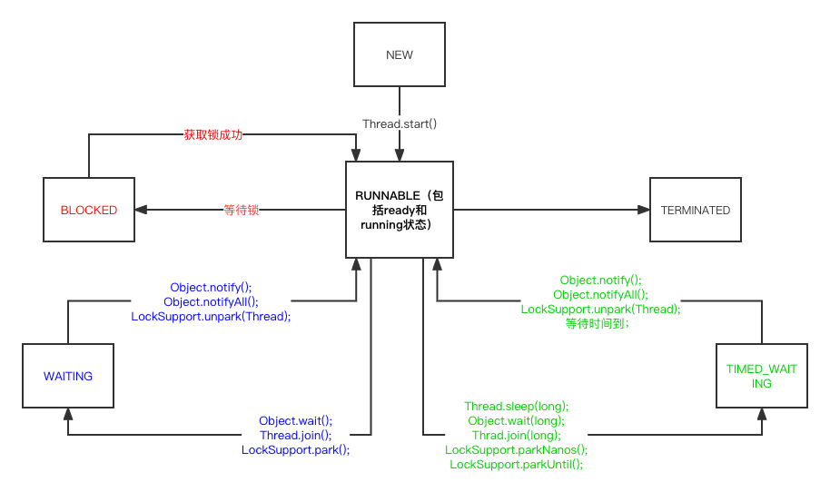

java线程的6个状态：NEW,RUNNABLE,BLOCKED,WAITING,TIMED_WAITING,TERMINATED.
* NEW: 处于NEW状态的线程此时尚未启动后。这里的尚未启动指的是还没有调用Thread实例的start()方法。
* RUNNABLE: 表示当前线程正在运行中。处于RUNNABLE状态的线程在Java虚拟机中运行，也有可能在等待CPU分配资源。
* BLOCKED: 阻塞状态。处于BLOCKED状态的线程正等待锁的释放以进入同步区。
* WAITING: 等待状态。处于等待状态的线程变成RUNNABLE状态需要其他线程唤醒。 
  * 调用如下3个方法会使线程进入等待状态：
    * Object.wait(): 是当前线程处于等待状态直到另一个线程唤醒它；
    * Thread.join(): 等待线程执行完毕，底层调用的是Object实例的wait方法；
    * LockSupport.park(): 除非获得调用许可，否则禁用当前线程进行线程调度。
* TIMED_WAITING: 超时等待状态。线程等待一个具体的时间，时间到后会被自动唤醒。
  * 调用如下方法会使线程进入超时等待状态：
    * Thread.sleep(long millis): 使当前线程睡眠指定时间；
    * Object.wait(long timeout)：线程休眠指定时间，等待期间可以通过notify()/notifyAll()唤醒；
    * Thread.join(long millis)：等待当前线程最多执行millis毫秒，如果millis为0，则会一直执行；
    * LockSupport.parkNanos(long nanos)： 除非获得调用许可，否则禁用当前线程进行线程调度指定时间；
    * LockSupport.parkUntil(long deadline)：同上，也是禁止线程进行调度指定时间。
* TERMINATED: 终止状态。此时线程已执行完毕。

*** 线程状态转换图

  
